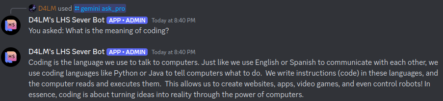
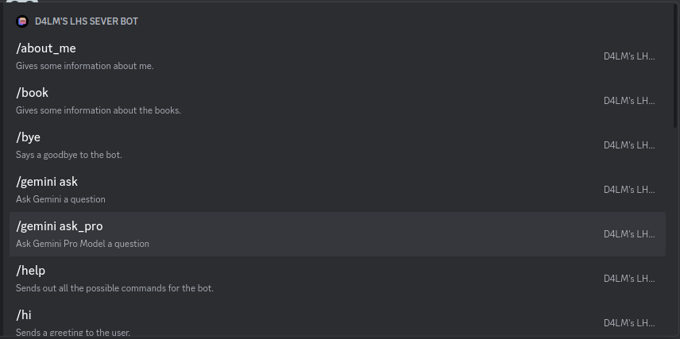

# D4LM's Largo High School Coding Club Discord Bot
A Discord Bot integrated into the Largo High School Coding Club's Discord Server. Actively helps the club run, ultimately allowing people like me (D4LM) avoid overwork by sending some of the workload to this Discord Bot.

## Showcase:

## Looking for maintainers & co-developers
* If you are interested go to one of the Largo High School Coding Club meetings & talk with one of the leaders.
* We need people like you to help create new ideas, maintain this bot so that D4LM is not overworked making this bot.

## Index
* Why do I need D4LM's LHSCC Discord Bot?
  * Specifications required to run it or use it
* Installing D4LM's LHSCC Discord Bot for your own purposes
  * Windows
  * Linux
  * MacOS
  * ChromeOS
* Post-installation
* Configuration
  * Creation of new slash commands
* How to run D4LM's LHSCC Discord Bot
* Troubleshooting
* Discussion
* Donate
* Code Contribution

## Why do I need D4LM's LHSCC Discord Bot?
One of the problems that I have with running a club that is very small is nobody will distribute the workload. For example, my sponsor for my club deos not play a huge role in the club. 

These issues can be mitigated by finding a new sponsor and/or forcing others to do more work. This usually will lead to the collapse of the club very quickly.

Other fixes such as retiring is not an option for me as I am not a senior & the Coding Club will collapse due to lack of leadership.

Given all the above, I needed a simple tool that would reduce my workload & save some time & resources, but allow others to run the club still. That's how D4LM's Largo High School Coding Club Discord Bot was born.

Please note: I would not recommend installing other Discord Bots as this one has many features that could conflict with other Discord Bots.

One bot that does not conflict with D4LM's LHSCC Discord Bot **as of right now** is Crypt's Discord Bot.

### Supported architecture & devices
Only devices that support Discord are supported using the bot. You may check this [Discord Article](https://support.discord.com/hc/en-us/articles/213491697-What-are-the-OS-system-requirements-for-Discord).

For running the Discord Bot, here are the minimum specification & recommended specifications:

|                  | Minimum Specification                            | Recommended Specification (From my laptop)                 |
|------------------|--------------------------------------------------|------------------------------------------------------------|
| Operating System | Any that supports Python.                        | Ubuntu 24.04 (Noble Numbat) or any that are still updated. |
| CPU              | x86 & Arm Based.                                 | At least Intel Core i5-5200u or better.                    |
| GPU              | Any as long as it has IGPU.                      | Intel HD Graphics 5500 or better.                          |
| Ram              | 4 MB (Without including OS.                      | 6 GB DDR3L 1600MHz or better.                              |
| Storage          | 200 MB (Without including OS.                    | 384 GB of SSD Sata storage or better.                      |
| Network          | 5 MB/s of download speed 1 MB/s of upload speed. | 300 MB/s of download speed & 10 MB/s of upload Speed.      |

## Features
* Pre-Built Commands
  * /help
  * /ping
  * etc.
* Basic Math
  * Addition
  * Subtraction
  * Division
  * Multiplication
* Gemini AI Integration
  * Ask Gemini either with fast or pro model
* Ability to add commands

## Installing D4LM's LHSCC Discord Bot

## TODO
* Add stuff to README.MD such as instructions to run & install...
* Add a way for the Discord bot to greet people who join the Discord Server
* Add a way for the Discord bot to say goodbye to people who leave the Discord Server.
* Allow a way for it to create events...
